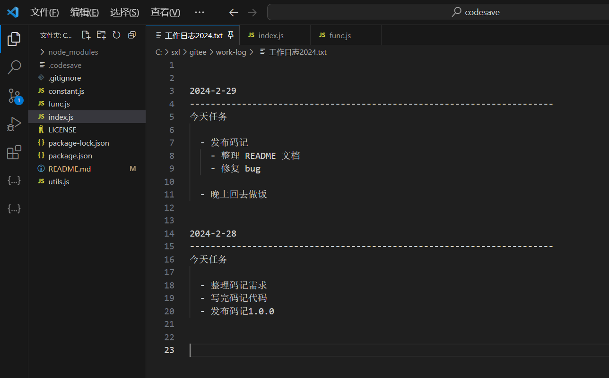

# 码记


码记: 程序员专用的笔记软件, 它把 git 仓库当做存储笔记的地方. 并且固定时间自动同步 git 仓库

---

基于 git 仓库, 优点: 私密, 多端同步, 可以当做文档网盘使用

## 功能概述

- 自动同步
- 立即同步
- 打开 vsCode
- [开启|关闭] 自动同步

## 安装

建议使用 npm 全局安装

    npm install -g codesave

然后到你的 git 仓库中运行

    $ cd /仓库地址/
    $ codesave

看到这个输出就证明启动成功了

```
---------------------
欢迎使用 [码记]
---------------------

1. 开始自动同步 [开启]
2. 立刻同步代码
3. 打开 vsCode
4. [关闭] 默认同步
5. 帮助
6. 退出
   请输入指令序号, 按下回车键结束:

已开始自动同步
自动同步频率为: 1 小时 0 分钟 0 秒
本次同步时间为： 2024-02-29 14:21:51
同步失败
---

请继续输入:
```

## 去哪里编辑呢?

我一般都是用 vscode 来当做编辑器, 我甚至可以一边写代码一边看笔记


